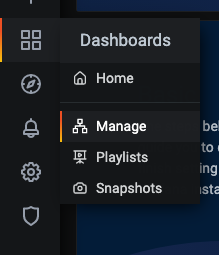
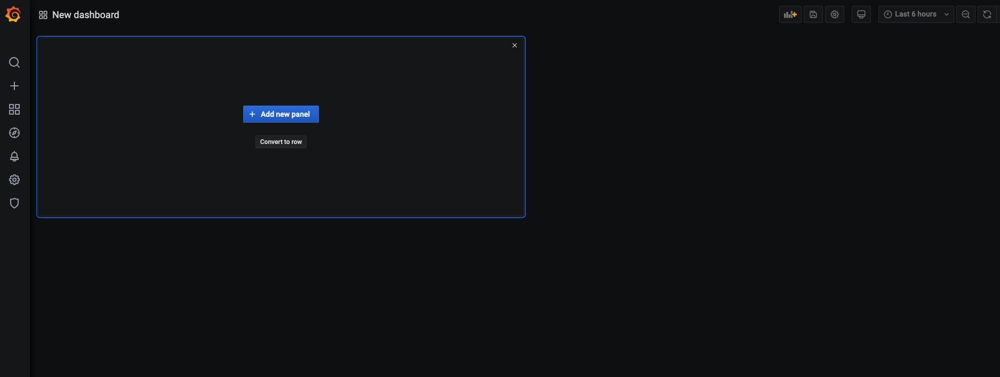

# Introduction

In this set of instructions we'll create a new Grafana dashboard and get it showing your new custom metrics.

### Step 1 - Port forwarding for Grafana

Your port forwarding (for Grafana) from the previous might have timed out now.

If you go to [http://127.0.0.1:9001](http://127.0.0.1:9001) and it times out you'll know that the port-forwarding has stopped.

If you do receive a timeout then simply restart your port forwarding by running:

```
kubectl port-forward svc/kube-prom-stack-grafana 9001:80
```

Then if you open up [http://127.0.0.1:9001](http://127.0.0.1:9001) you should see the Grafana homepage.

It will ask you to log in, the default setup uses the following credentials:

**Username:** admin 

**Password:** prom-operator

### Step 2 - Create a new dashboard

Once you're on the Dashboard screen, hover over the Dashboards menu icon and click **Manage**



Then click the **New Dashboard** button.

You should see something similar to the following:



### Step 3 - Add an App Info Panel

Click on the **Add new panel** button and then follow this short video (click on **View Raw** to download it) for creating your dashboard.

[Custom Dashboard Creation](../videos/custom_dashboard.mp4)

Once you've got your custom dashboard created make sure to take a screenshot and share that as your assignment submission in Google classroom.

Marvel at all your ops skills and head back to the [README for information on tearing things](../README.md) down and saving on costs!


