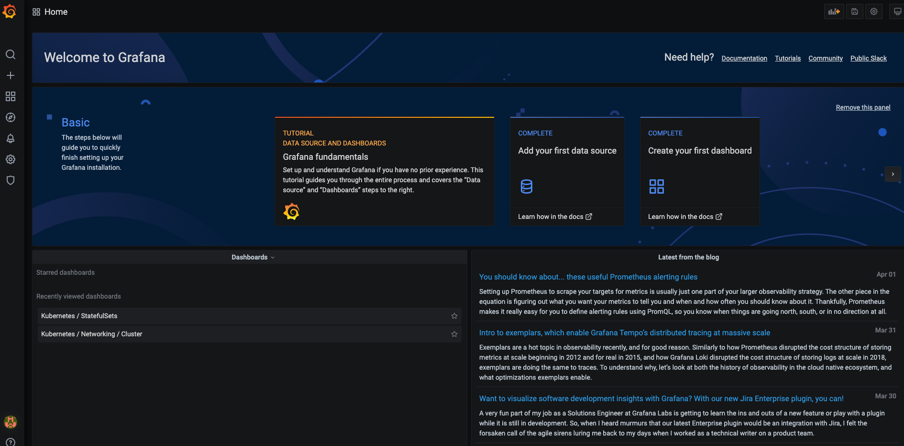

# Introduction

The guide below walks you through deploying the [Prometheus monitoring](https://prometheus.io/) stack.

It will make use of ArgoCD and Helm to deploy the stack to your cluster.

### Step 1 - Deploying the prometheus stack

The first step will require us to deploy the various Prometheus services, pods, volumes etc. As you might have guessed, we shall be continuing to build on existing knowledge and deploy this stack as a Helm chart using ArgoCD.

Thankfully the prometheus community already has a [ready made Helm chart](https://github.com/prometheus-community/helm-charts/tree/main/charts/kube-prometheus-stack) for us.

In this directory you'll see that we have taken a copy of the **kube-prometheus-stack** Helm chart which includes all the required setup for the prometheus stack. 

- Open up ArgoCD in your browser - [this link should work](https://127.0.0.1:9000/applications) if you've configured the port-forwarding.

- Click on **New App** shown in the top left of the screen.

- Enter **kube-prom-stack** for the **application name**

- Choose **default** for the **project**

- You can leave the **Sync Policy** and **Sync Options** as defined.

- Enter **https://github.com/techreturners/devops-upskill-monitoring-logging.git** for the **Repository URL**

- Choose the **kube-prometheus-stack** option for the **Path**

- Choose the **https://kubernetes.default.svc** for the **Cluster URL**

- Enter **default** for the **Namespace**

- The **Helm** section can all be left as the default settings

-  Then click the **Create** button shown towards to top of the dialog you are viewing

Argo will take a moment before going back to the **Applications** screen where you will see a new application called **kube-prometheus-stack**

Now you can click the **Sync** button followed by **Synchronize** to deploy the full prometheus stack across your cluster.

After a few moments you should be able to see prometheus pods running on your cluster by running `kubectl get pods` which should output something similar to:

```
NAME                                                     READY   STATUS    RESTARTS   AGE
alertmanager-kube-prom-stack-kube-prome-alertmanager-0   2/2     Running   0          2m50s
kube-prom-stack-grafana-857f644995-nm5l4                 2/2     Running   0          3m2s
kube-prom-stack-kube-prome-operator-6479d4b85b-ftglr     1/1     Running   0          3m2s
kube-prom-stack-kube-state-metrics-cb9c4759f-t962s       1/1     Running   0          3m2s
kube-prom-stack-prometheus-node-exporter-59gjl           1/1     Running   0          3m3s
kube-prom-stack-prometheus-node-exporter-glf2q           1/1     Running   0          3m3s
kube-prom-stack-prometheus-node-exporter-t8mnz           1/1     Running   0          3m3s
prometheus-kube-prom-stack-kube-prome-prometheus-0       2/2     Running   1          2m44s
```
### Step 2 - Accessing and playing with Grafana

The purpose of Prometheus is to record metrics but we need a UI tool to provide charts and visuals of those metrics we record.

That is where [Grafana](https://grafana.com/) comes in to help.

The previous kubernetes stack also deployed Grafana for us.

We can access it now by utilising port forwarding again.

Open up a new terminal and run

```
kubectl port-forward svc/kube-prom-stack-grafana 9001:80
```

Then if you open up [http://127.0.0.1:9001](http://127.0.0.1:9001) you should see the Grafana homepage.

It will ask you to log in, the default setup uses the following credentials:

**Username:** admin 

**Password:** prom-operator

You should see an image similar to the following:



### Step 3 - Reviewing the pre-built dashboards

The kube-prometheus-stack comes with a few pre-built dashboards for us.

Lets take a look at the monitoring we have on a Node level. A **node** being a server (machine) that forms part of our Kubernetes cluster.

On the left hand side menu, hover of the **Dashboards** icon and click **Manage**.


Scroll down on the manage screen until you see **Nodes** and click to see the dashboard.

Here you can see charts observing the information from your nodes such as **Memory Usage**, **Network Traffic** and **CPU Usage**

Now that you've got Kubernetes installed, head [back to the next step](./INSTRUCTIONS.md) and move onto instrumenting your application.


